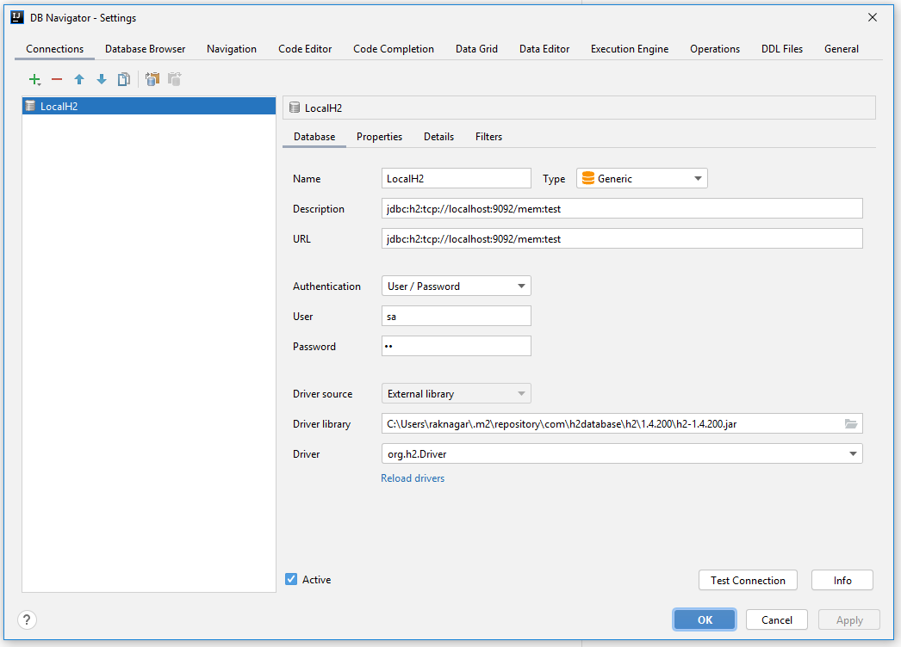

## Spring Boot H2 Database Server

Use Spring Boot to run local H2 database server. Handy lightweight local database server

#### Start the DB Server
```properties
mvn clean spring-boot:run
```

#### Use the below connection string to connect to this database from outside
```properties
spring.datasource.url=jdbc:h2:tcp://localhost:9092/mem:test;
spring.datasource.username=sa
spring.datasource.password=sa
```
#### Manage Schema
Manage database DDLs and DMLs using the Liquibase scripts at `src/main/resources/db/changelog`

#### Connect Using IntelliJ DB Browser

